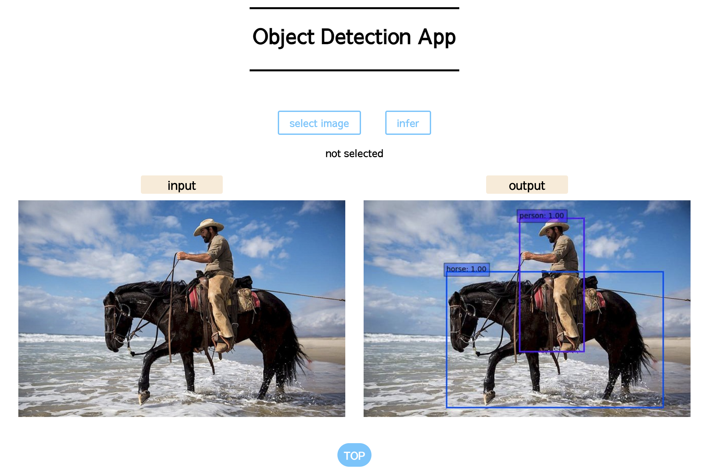

# Object Detection App


This is a pytorch implementation of objext detection in pytorch.

This repositroy includes:
- Training and Evaluation Codes
- Flask Object Detection App

Flask Object Detection App


## app setup

1. Clone this repository
```bash
git clone https://github.com/noji0101/Object-Detection-App.git
```

2. Download trained weight

Download from [here](https://drive.google.com/uc?export=view&id=1MJGY8bf_1ke_Huwxbfn7Ugd6epgs93uh)

Then put the weight file in Object-Detection-App/data
```bash
cd Object-Detection-App
mkdir data
```

3. Build docker image
```bash
docker build ./ -t {your-image-name} --build-arg USER_ID=$(id -u) --build-arg GROUP_ID=$(id -g)
```

4. Run docker image
```bash
docker run -it --gpus {your-device} -p 8888:80 -v /home/{user}/Object-Detection-App:/workspace --name {container-name} {your-image-name}
```

5. start flask app
```bash
python app/main.py
```

6. Accees loaclhost:8888 on your browser!

## train
```bash
python train.py
```

## eval
```bash
python train.py --eval
```

Defalut config file is **configs/default.yaml**

If you want to use another config file,
add configfile command like this
```bash
python train.py --configfile ./configs/foo.yaml
```